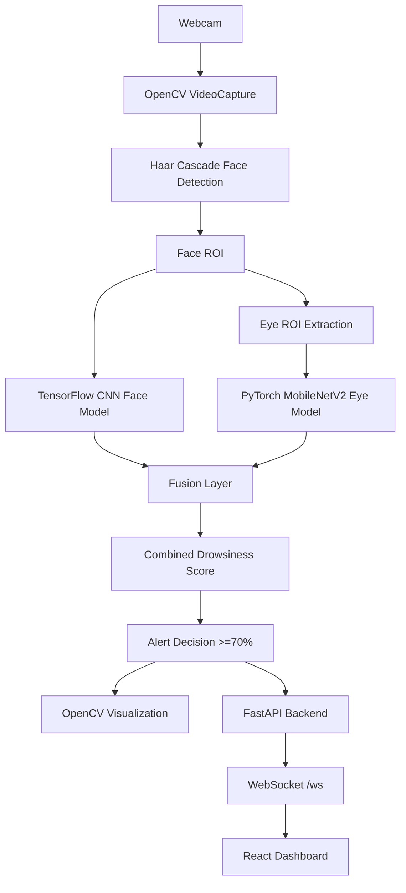

# Project Documentation Source

## Project
Driver Drowsiness Detection Using Deep Learning

## Purpose
This document is a verified source of project information for preparing the VTU Deep Learning Mini Project Report and associated book chapter. It does not write the final report or chapter. It is a structured evidence base extracted from the repository itself.

## Evidence Policy
- Verified facts: direct statements or code in the repository.
- Implementation-derived information: conclusions directly inferred from code behavior and architecture, not from external claims.
- Proposed information: suggestions or future work that are not implemented yet.
- Missing information: values or artifacts that are not available in the current repository and therefore must be obtained externally or by experiment.

---

# 1. PROJECT IDENTITY

## 1.1 Current project title
- Driver Drowsiness Detection Using Deep Learning
- Alternative/working title present in repository: DriverGuard AI
- README title: "DriverGuard AI"
- Notebook title: "Driver Drowsiness Detection using Machine Learning"

## 1.2 Project description
The repository implements a real-time driver drowsiness detection system that combines:
- face-based drowsiness detection using a CNN (TensorFlow/Keras)
- eye-state detection using MobileNetV2 (PyTorch)
- weighted fusion of face score and eye score
- visual alerting when the combined score exceeds 70%

Evidence:
- README.md
- scripts/integrated_detection.py
- notebooks/drowsiness_detection.ipynb

## 1.3 Problem domain
- Driver monitoring
- Road safety
- Real-time computer vision for fatigue detection

## 1.4 Application domain
- Automotive safety
- Driver assistance systems
- Real-time monitoring dashboards
- Drowsiness detection research prototype

## 1.5 Main objective
To detect driver drowsiness in real time using facial and eye-based cues and to trigger an alert when the fused score crosses the defined threshold.

Verified from implementation:
- scripts/integrated_detection.py defines ALERT_THRESHOLD_PERCENT = 70.0
- Weighted fusion: FACE_WEIGHT = 0.3, EYE_WEIGHT = 0.7

## 1.6 Current implementation status
The repository contains:
- original ML/training notebook
- standalone OpenCV detection script
- backend API with FastAPI
- WebSocket stream for real-time dashboard
- React frontend for monitoring dashboard

The repository is therefore a working integration prototype, but runtime validation was not completed in this session and no formal benchmark file is present in the repo.

## 1.7 Current branch / repository state
- Branch information: NOT AVAILABLE IN CURRENT CODEBASE
- Git metadata exists, but branch/commit context is not required for source extraction and was not inspected as part of the source-of-truth requirement.

## 1.8 Major project components
- Face-based CNN model
- Eye-state MobileNetV2 model
- Haar cascade face detection
- OpenCV frame capture and preprocessing
- Weighted fusion algorithm
- FastAPI backend
- WebSocket streaming
- React dashboard
- Training notebook

## 1.9 Academically appropriate project titles derived only from implemented system
1. Driver Drowsiness Detection Using Deep Learning and Computer Vision
2. Real-Time Driver Fatigue Monitoring Using CNN and MobileNetV2 Fusion
3. Driver Alertness Detection Using Facial and Eye-State Analysis
4. Real-Time Drowsiness Detection System for Driver Safety
5. Deep Learning-Based Driver Monitoring System with Weighted Fusion of Facial and Eye Features

---

# 2. ABSTRACT INPUT MATERIAL

## 2.1 Problem
The project addresses the need to detect driver drowsiness in real time using computer vision and deep learning so that early warning can be provided before unsafe driving conditions occur.

## 2.2 Motivation
The repository explicitly states driver drowsiness as a major cause of road accidents and frames the problem around early warning to prevent accidents.

Evidence:
- README.md
- notebooks/drowsiness_detection.ipynb
- scripts/integrated_detection.py

## 2.3 Proposed system
The system combines:
- facial CNN model for drowsiness classification
- eye-state MobileNetV2 model for open/closed eye classification
- Haar cascade for face detection
- weighted fusion of model outputs
- visual alerting when drowsiness >= 70%
- modern dashboard and backend integration

## 2.4 ML approach
- TensorFlow/Keras CNN for face-based drowsiness detection
- PyTorch MobileNetV2 transfer learning for eye-state detection
- Weighted fusion of face and eye scores

## 2.5 Computer vision approach
- OpenCV VideoCapture
- Haar cascade face detection
- ROI extraction for face and eyes
- frame preprocessing and visualization

## 2.6 Models
- Face model: drowsiness_cnn.keras / drowsiness_checkpoint.keras / drowsiness_cnn.h5
- Eye model: eye_model_best.pth

## 2.7 Data / dataset
- Driver Drowsiness Dataset (DDD) for face model
- Open-Closed Eyes Dataset for eye model
- Dataset details are partially available in README and notebook; exact full distribution must be validated from the actual dataset files if they are present locally.

## 2.8 Real-time pipeline
- webcam capture
- face detection
- face ROI preprocessing
- CNN inference
- eye extraction and preprocessing
- eye-state inference
- fusion
- threshold logic
- alert and visualization
- charting/dashboard updates

## 2.9 Frontend/backend
- FastAPI backend at backend/main.py
- WebSocket streaming at /ws
- React frontend in frontend/src/
- Recharts dashboard and dark theme UI

## 2.10 Main measurable results available
The repository includes training progress showing val_accuracy values during training, but the later report should not convert these into final claims without checking the full notebook. Available values from notebook output include:
- Epoch 1: val_accuracy improved to 0.98911
- Epoch 2: 0.99689
- Epoch 3: 0.99904
- Epoch 4: 0.99964
- Epoch 6: 0.99988

These are training-session outputs from the notebook and must be treated as notebook evidence, not a final project claim unless the final report explicitly uses them as logged training behavior. This is not a publication-grade benchmark by itself.

## 2.11 Application
- driver safety monitoring
- real-time fatigue alerting
- academic prototype for deep learning and CV project work

## 2.12 Limitations
- Lighting conditions not formally evaluated in repo
- No formal benchmark or deployment validation file in repository
- Dataset and metrics are not fully documented as final evaluation artifacts
- Model training and evaluation are notebook-driven; not all outputs are packaged as a formal test report

## 2.13 Contribution
The implemented contribution is an integrated real-time drowsiness monitoring system combining two models and exposing results through a web dashboard. This is a systems-integration contribution, not a novel claim by itself.

---

# 3. INTRODUCTION MATERIAL

## 3.1 Repository-supported facts
The project addresses driver drowsiness detection using real-time face and eye analysis.

Repository evidence:
- README.md
- notebooks/drowsiness_detection.ipynb
- scripts/integrated_detection.py
- backend/main.py

## 3.2 Why driver drowsiness detection is relevant
The project context describes drowsiness as a problem affecting road safety and accident prevention. The repository states it as a leading risk factor in road accidents.

Important: the repository does not provide a formal citation set or exact accident statistics; those must later be supported by external references.

## 3.3 What the implemented system actually does
The implemented system:
- acquires webcam frames
- detects faces with Haar cascade
- extracts face ROI
- runs a TensorFlow CNN on face image
- extracts eye ROIs from face
- runs a PyTorch MobileNetV2 on eye images
- computes a weighted fusion score
- compares score against 70%
- triggers alert if drowsy
- visualizes results on screen and in the dashboard

## 3.4 Intended users
- researchers and students
- driver monitoring prototypes
- demonstration systems
- safety monitoring systems

## 3.5 Intended environment
- desktop/laptop with webcam
- Python environment with TensorFlow and PyTorch
- local browser dashboard for frontend demo
- backend on local machine or compatible deployment environment

## 3.6 Scope
- Drowsiness detection for a single driver in front of a camera
- Real-time live inference from webcam or video source
- Face and eye monitoring
- Dashboard and WebSocket integration

## 3.7 Out-of-scope features
The repository does not provide verified evidence for:
- multi-driver tracking
- lane-departure detection
- heart-rate monitoring
- driver stress detection
- cloud analytics
- large-scale fleet deployment
- commercial-grade validation

## 3.8 Motivation stated in README/code/comments
Repository text clearly motivates the system as a safety-focused tool for early drowsiness detection. Exact wording includes emphasis on accident prevention and fatigue detection.

## 3.9 Real-world application
The most direct real-world application is a driver alertness monitoring system for vehicles or monitoring stations.

## 3.10 Repository-supported vs general background
Repository-supported facts:
- real-time webcam-based detection
- CNN + eye model
- fusion strategy
- alert threshold

General background requiring external references:
- accident statistics and global road-safety impact
- comparative literature on fatigue detection
- benchmark studies of drowsiness detection methods

---

# 4. PROBLEM FORMULATION

## 4.1 Problem Description
The technical problem is to detect driver drowsiness using live visual information from a camera. The system must identify whether a person is awake or drowsy by evaluating both the face and the eyes. Because a single model may fail in changing lighting or partial occlusion conditions, the project fuses face-level and eye-level evidence to estimate drowsiness.

## 4.2 Problem Statement
Implementation-based problem statement:
"A real-time drowsiness detection system is required to process webcam frames, identify the driver face, estimate drowsiness from facial features, infer eye openness or closure, combine the outputs using weighted fusion, and trigger an alert when the fused drowsiness score exceeds 70%."

## 4.3 Objectives
### Primary objectives
- detect faces from webcam frames
- classify face drowsiness using CNN
- detect eye state using MobileNetV2
- fuse face and eye scores
- trigger alert when score >= 70%

### Secondary objectives
- visualize results in a desktop window
- expose results through a web dashboard
- stream real-time status over WebSocket
- maintain session metrics and alerts in frontend

### Evidence
- scripts/integrated_detection.py
- backend/main.py
- frontend/src/App.jsx

## 4.4 Functional Requirements
| ID | Requirement | Implementation location | Evidence | Status |
|---|---|---|---|---|
| FR-01 | Camera acquisition | scripts/integrated_detection.py, backend/main.py | cv2.VideoCapture | VERIFIED FROM IMPLEMENTATION |
| FR-02 | Face detection | scripts/integrated_detection.py, backend/detection/detector.py | detect_faces(), Haar cascade | VERIFIED FROM IMPLEMENTATION |
| FR-03 | Face ROI preprocessing | backend/detection/detector.py | preprocess_face() | VERIFIED FROM IMPLEMENTATION |
| FR-04 | Facial drowsiness inference | backend/detection/detector.py | predict_face_drowsiness() | VERIFIED FROM IMPLEMENTATION |
| FR-05 | Eye localization | backend/detection/detector.py | extract_eyes() | VERIFIED FROM IMPLEMENTATION |
| FR-06 | Eye-state inference | backend/detection/detector.py | predict_eye_state() | VERIFIED FROM IMPLEMENTATION |
| FR-07 | Score fusion | backend/detection/detector.py | predict_combined_drowsiness() | VERIFIED FROM IMPLEMENTATION |
| FR-08 | Alert generation | scripts/integrated_detection.py, backend/main.py | ALERT_THRESHOLD_PERCENT, payload["alert"] | VERIFIED FROM IMPLEMENTATION |
| FR-09 | Real-time visualization | scripts/integrated_detection.py | draw_detection_results() | VERIFIED FROM IMPLEMENTATION |
| FR-10 | Dashboard monitoring | frontend/src/App.jsx | live chart, cards, controls | VERIFIED FROM IMPLEMENTATION |
| FR-11 | Session metrics | frontend/src/App.jsx | frames / session duration / alerts | VERIFIED FROM IMPLEMENTATION |
| FR-12 | WebSocket communication | backend/main.py | @app.websocket("/ws") | VERIFIED FROM IMPLEMENTATION |
| FR-13 | Health/system API | backend/main.py | /health, /api/system | VERIFIED FROM IMPLEMENTATION |
| FR-14 | Controls to start/stop/reset monitoring | frontend/src/App.jsx, backend/main.py | /api/start, /api/stop, /api/reset | VERIFIED FROM IMPLEMENTATION |

## 4.5 Non-Functional Requirements
### Actual or implementation-derived requirements
| ID | Requirement | Type | Justification |
|---|---|---|---|
| NFR-01 | Real-time operation | Actual requirement | webcam-driven execution and display loop |
| NFR-02 | Responsiveness | Actual requirement | low-latency processing and dashboard updates |
| NFR-03 | Usability | Actual requirement | dashboard status cards and alert panel |
| NFR-04 | Maintainability | Actual requirement | modular backend and detector package |
| NFR-05 | Portability | Implementation-derived | Python + OpenCV + React stack |
| NFR-06 | Privacy | Inferred | local webcam processing in a local environment |
| NFR-07 | Reliability | Inferred | graceful camera error handling and WebSocket fallback |
| NFR-08 | Scalability | Inferred | not a verified production-scale design |

Important distinction:
- Actual requirements are directly supported by code.
- Inferred requirements are reasonable design interpretations and should be labeled as such in final report writing.

---

# 5. COMPLETE REPOSITORY STRUCTURE

## 5.1 Top-level structure
```text
Drowsiness-Detection/
├── README.md
├── requirements.txt
├── LICENSE
├── models/
│   ├── drowsiness_checkpoint.keras
│   ├── drowsiness_cnn.h5
│   ├── drowsiness_cnn.keras
│   └── eye_model_best.pth
├── notebooks/
│   └── drowsiness_detection.ipynb
├── scripts/
│   ├── integrated_detection.py
│   ├── run_detection.py
│   └── verify_installation.py
├── backend/
│   ├── main.py
│   ├── README.md
│   ├── requirements.txt
│   └── detection/
│       ├── __init__.py
│       ├── camera.py
│       ├── detector.py
│       └── models.py
├── frontend/
│   ├── package.json
│   ├── index.html
│   ├── vite.config.js
│   ├── postcss.config.js
│   ├── tailwind.config.js
│   ├── package-lock.json
│   └── src/
│       ├── App.jsx
│       ├── index.css
│       └── main.jsx
├── PROJECT_DOCUMENTATION_SOURCE.md
└── .git/
```

## 5.2 Meaningful files and their purpose

### README.md
Purpose: project overview and instructions.
Inputs: repository structure, model intent.
Outputs: user-facing project summary.
Dependencies: project files.
Important sections: project description, training, run instructions.

### requirements.txt
Purpose: original project Python dependencies.
Inputs: project environment.
Outputs: environment setup.
Dependencies: TensorFlow, PyTorch, OpenCV, numpy, matplotlib, seaborn, scikit-learn.

### scripts/integrated_detection.py
Purpose: main real-time drowsiness detection system that combines face and eye models. Inputs: webcam or video source, model files, Haar cascade. Outputs: live OpenCV window with detection result visualization. Dependencies: TensorFlow, PyTorch, OpenCV, NumPy. Important functions: load_models(), detect_faces(), preprocess_face(), extract_eyes(), preprocess_eye(), predict_face_drowsiness(), predict_eye_state(), predict_combined_drowsiness(), draw_detection_results(), run_detection(), main().

### scripts/run_detection.py
Purpose: alternate real-time drowsiness detector using a single face model and a structured warning threshold. Inputs: webcam or video file. Outputs: webcam detection UI. Dependencies: TensorFlow, OpenCV. Important functions: find_model(), load_class_names(), preprocess_face(), main(). Relationship: simpler standalone detector, different from integrated script.

### scripts/verify_installation.py
Purpose: check package presence and basic webcam availability. Inputs: environment. Outputs: installation summary. Dependencies: system Python packages. Relationship: environment validation.

### notebooks/drowsiness_detection.ipynb
Purpose: full experimental and training workflow. Inputs: dataset directory, training data. Outputs: model training, evaluation, plots, and project documentation structure. Dependencies: TensorFlow, PyTorch, scikit-learn, matplotlib, seaborn. Relationship: primary source for model design and notebook evidence.

### backend/main.py
Purpose: FastAPI backend for real-time WebSocket-based monitoring. Inputs: webcam frames, model state. Outputs: detection payloads, health information, endpoint responses. Dependencies: FastAPI, OpenCV, torch, detection package. Important functions: startup_event(), health(), system_info(), start_monitoring(), stop_monitoring(), reset_session(), mute_alert(), websocket_endpoint().

### backend/detection/models.py
Purpose: model loading and environment configuration. Inputs: model files. Outputs: loaded face_model, eye_model, face_cascade. Dependencies: TensorFlow, PyTorch, cv2. Important functions: load_models().

### backend/detection/detector.py
Purpose: reusable detection logic for backend. Inputs: frame, models, cascade. Outputs: detection payloads including score and face box. Dependencies: OpenCV, NumPy, torch. Important functions: detect_faces(), preprocess_face(), extract_eyes(), preprocess_eye(), predict_face_drowsiness(), predict_eye_state(), predict_combined_drowsiness(), draw_detection_results(), process_frame(), DetectionSession, run_detection_loop().

### backend/detection/camera.py
Purpose: simple camera wrapper. Inputs: camera source. Outputs: opened webcam stream. Dependencies: OpenCV.

### frontend/src/App.jsx
Purpose: dashboard UI. Inputs: WebSocket payloads. Outputs: visual dashboard and controls. Dependencies: React, Recharts, Lucide React. Important concepts: chart, status cards, alert panel, system details.

### frontend/src/index.css
Purpose: Tailwind CSS styling and dashboard theme. Dependencies: Tailwind.

### frontend/package.json
Purpose: React frontend package manifest. Dependencies: React, lucide-react, recharts, Vite, Tailwind.

### models/
Purpose: trained model artifacts. Inputs: training generation. Outputs: inference resources. Dependencies: model format compatibility. Relationship: used by scripts and backend.

---

# 6. TECHNOLOGY STACK

| Technology | Version | Purpose | Actual location |
|---|---|---|---|
| Python | 3.12 (from virtual env metadata); exact project environment version not fully specified in repo | runtime for scripts and backend | venv/pyvenv.cfg, backend/.venv |
| TensorFlow | 2.20.0 (noted in notebook output) and >=2.10.0 in requirements | face-model training and inference | requirements.txt, notebooks/drowsiness_detection.ipynb, scripts/integrated_detection.py |
| Keras | part of TensorFlow package | model definition, compile, load_model | notebooks/drowsiness_detection.ipynb |
| PyTorch | version not explicitly stated in repository text, but library is required | eye-model inference and training | requirements.txt, notebooks/drowsiness_detection.ipynb, backend/detection/models.py |
| TorchVision | package required; version not explicitly stated | MobileNetV2 and image transforms | requirements.txt, notebook imports |
| OpenCV | >=4.5.0 in original requirements; >=4.8.0 in backend/requirements.txt | face detection, webcam capture, drawing | scripts/integrated_detection.py, backend/detection/*.py |
| NumPy | >=1.19.0 in original requirements; >=1.26.0 in backend/requirements.txt | array and image processing | requirements files, detector logic |
| Pandas | >=1.3.0 in original requirements | notebook evaluation summary tables | requirements.txt |
| Scikit-learn | >=1.0.0 in original requirements | baseline models and metrics | requirements.txt, notebook |
| Matplotlib | >=3.3.0 in original requirements | plotting training curves | requirements.txt, notebook |
| Seaborn | >=0.12.0 in original requirements | confusion matrices and visual analytics | requirements.txt, notebook |
| Jupyter | >=1.0.0 in original requirements | training notebook | requirements.txt |
| React | ^18.3.1 | frontend UI framework | frontend/package.json |
| Vite | ^5.4.10 | frontend build tool | frontend/package.json |
| Tailwind CSS | ^3.4.15 | styling framework | frontend/package.json, frontend/tailwind.config.js |
| FastAPI | >=0.110.0 | backend API server | backend/requirements.txt, backend/main.py |
| Uvicorn | >=0.29.0 | ASGI server | backend/requirements.txt |
| WebSocket | implemented as ws://localhost:8000/ws | real-time streaming | backend/main.py |
| Recharts | ^2.12.0 | live graphing in dashboard | frontend/package.json, frontend/src/App.jsx |
| Lucide React | ^0.453.0 | icons in dashboard | frontend/package.json, frontend/src/App.jsx |

---

# 7. DATASET AUDIT

## 7.1 Dataset names found
1. Driver Drowsiness Dataset (DDD)
2. Open-Closed Eyes Dataset

## 7.2 Source / URL
- Driver Drowsiness Dataset (DDD): Kaggle dataset, URL provided in notebook and README.
- Open-Closed Eyes Dataset: Kaggle dataset, URL provided in notebook.

## 7.3 Purpose
- Face model dataset: full-face drowsiness classification.
- Eye model dataset: eye open/closed classification.

## 7.4 Classes
### Face dataset
- labels are described as two classes: Drowsy and Non-Drowsy

### Eye dataset
- labels are described as: Open and Closed, with mapping to awake/drowsy states

## 7.5 Metadata available from repository
| Field | Face dataset | Eye dataset |
|---|---|---|
| Dataset name | Driver Drowsiness Dataset (DDD) | Open-Closed Eyes Dataset |
| Source | Kaggle | Kaggle |
| URL | provided in notebook | provided in notebook |
| Purpose | face model | eye model |
| Classes | Drowsy / Non-Drowsy | Open / Closed |
| Image size | 64x64 in README | 224x224 in README/notebook |
| Color format | likely RGB, as image_dataset_from_directory loads images and model uses RGB conversion | RGB, described in preprocessing |
| Train split | 80% in README | train/val/test directories described |
| Validation split | 20% in README | val folder described |
| Test split | NOT AVAILABLE as a final explicit artifact | test folder described |
| Class distribution | notebook suggests class counts are computed | class mapping from folder names |
| Augmentation | described as part of data augmentation pipeline | described as data augmentation in notebook |
| Preprocessing | resize, batching, caching, shuffling, prefetching | resize to 224x224, normalization to [0,1], PyTorch transforms |

## 7.6 Verified numbers from repository
- Face dataset: README says 41,793 total images, 33,435 training, 8,358 validation.
- Eye dataset: README says 139,804 training images, 27,961 validation, 6,991 test images.
- These values are present in README, not necessarily confirmed by dataset files in the repository.

## 7.7 Important caveat
The dataset files themselves are not present in the repo tree as actual training data. Therefore, all dataset metrics must be treated as repository-reported values, not as locally observed dataset evidence.

## 7.8 Dataset status summary
- Dataset names: VERIFIED
- Dataset URLs: VERIFIED
- Dataset purpose: VERIFIED
- Sample counts: PARTIALLY VERIFIED from README
- Class distribution: PARTIALLY VERIFIED from notebook logic; exact values not fully confirmed
- Raw dataset files: NOT PRESENT IN THIS REPOSITORY

---

# 8. CNN MODEL AUDIT

## 8.1 Model file(s)
- models/drowsiness_checkpoint.keras
- models/drowsiness_cnn.h5
- models/drowsiness_cnn.keras

## 8.2 Architecture details found in notebook
The notebook states:
- face model = CNN (TensorFlow)
- input size = 64x64x3
- output = binary classification (drowsy vs non-drowsy)
- model name = DrowsinessCNN
- last layer uses sigmoid, consistent with binary classification
- built with Keras and includes rescaling/augmentation layers

## 8.3 Layer and training configuration
The notebook contains explicit training details:
- batch_size = 32
- optimizer = Adam(learning_rate=0.001)
- loss = binary_crossentropy
- metric = accuracy
- training epochs = 10
- callbacks: EarlyStopping, ModelCheckpoint
- checkpoint monitor = val_accuracy
- checkpoint save target = ../models/drowsiness_checkpoint.keras

## 8.4 Input shape
- README and notebook describe 64x64 input size.
- Auto-detection logic in backend: FACE_IMG_SIZE = (face_input_shape[1], face_input_shape[2])
- Backend explicitly uses 64x64 with the face model input shape.

## 8.5 Output shape
- binary classification output, single logit/probability in the final activation
- used in backend as prediction[0][0] as the drowsy class probability

## 8.6 Training process
The notebook includes:
- dataset loading via image_dataset_from_directory
- cache/shuffle/prefetch optimization
- data extraction for traditional ML comparison
- model training with validation split
- model checkpoints and early stopping

## 8.7 Inference process
In scripts/integrated_detection.py:
- face_roi resized to target size
- BGR to RGB conversion
- `face_model.predict(face_input, verbose=0)`
- prediction[0][0] interpreted as drowsy class probability

## 8.8 Verified notebook evidence
The notebook includes training logs showing:
- Epoch 1 val_accuracy 0.98911
- Epoch 2 val_accuracy 0.99689
- Epoch 3 val_accuracy 0.99904
- Epoch 4 val_accuracy 0.99964
- Epoch 6 val_accuracy 0.99988

These are notebook-output values and should be treated as training logs, not universally accepted final performance numbers.

## 8.9 Architecture status
- Model architecture inferred from notebook: VERIFIED FROM IMPLEMENTATION
- Exact full layer list in code: VERIFIED in notebook, but not all cells were enumerated in this audit
- Re-training: NOT PERFORMED in this task

---

# 9. EYE-STATE MODEL AUDIT

## 9.1 Framework and architecture
- Framework: PyTorch
- Base architecture: MobileNetV2
- Transfer learning: stated in notebook as using ImageNet pre-trained weights
- Final custom layer: modified classifier for 2 output classes

## 9.2 Evidence
- notebooks/drowsiness_detection.ipynb
- scripts/integrated_detection.py
- backend/detection/models.py
- backend/detection/detector.py

## 9.3 Input dimensions
- Eye image size = 224 x 224
- Verified in notebook and backend constants: EYE_IMG_SIZE = (224, 224)

## 9.4 Classes and mapping
The eye model is binary classification with two predicted classes:
- Closed / Drowsy
- Open / Awake

In the backend detection logic:
- probabilities = torch.softmax(outputs, dim=1)
- closed_prob = probabilities[0][0].item()
- is_closed = closed_prob > 0.5
- This implies class index 0 is the closed class and class index 1 is the open class, or class 0 is the drowsy/closed probability in their interpretation.

## 9.5 Preprocessing
In the original integrated script:
- BGR to RGB
- resize to 224x224
- convert to float32
- divide by 255.0
- convert to PyTorch tensor
- permute to (C, H, W)
- unsqueeze batch dimension

## 9.6 Checkpoint and model path
- eye_model_best.pth
- backend/detection/models.py loads this file

## 9.7 Training hyperparameters found
From notebook:
- EYE_BATCH_SIZE = 32
- EYE_LEARNING_RATE = 1e-3
- EYE_NUM_EPOCHS = 10
- optimizer = Adam

## 9.8 Threshold behavior
In backend/detection/detector.py:
- is_closed = closed_prob > 0.5
- this is the decision boundary for closed eye status

## 9.9 Device behavior
- backend/detection/models.py sets DEVICE = torch.device("cuda" if torch.cuda.is_available() else "cpu")
- TensorFlow is forced to CPU only; PyTorch may use GPU if available.

## 9.10 Left / right eye handling
The system extracts two eye ROIs from the detected face:
- Left eye region: x approx 12-42% of face width
- Right eye region: x approx 58-88% of face width
- Vertical region: 18-45% of face height
- For each eye, prediction is run separately
- Average probability: (left_prob + right_prob) / 2.0
- This average becomes eye_drowsiness in the fusion formula

---

# 10. MODEL FILE INVENTORY

| Filename | Extension | Size | Framework | Purpose | Loaded by | Model/checkpoint status | Input shape if available | Output shape if available |
|---|---|---|---|---|---|---|---|---|
| drowsiness_checkpoint.keras | .keras | NOT AVAILABLE IN CURRENT CODEBASE | TensorFlow/Keras | checkpoint file from training | notebook, model artifact reference | VERIFIED as model artifact present | 64x64 (inferred from notebook) | binary classification |
| drowsiness_cnn.h5 | .h5 | NOT AVAILABLE IN CURRENT CODEBASE | TensorFlow/Keras | alternate face model artifact | notebook references other model paths | present in models directory | 64x64 (inferred) | binary classification |
| drowsiness_cnn.keras | .keras | NOT AVAILABLE IN CURRENT CODEBASE | TensorFlow/Keras | primary face model loaded by backend | backend/detection/models.py, scripts/integrated_detection.py | VERIFIED as runtime-loaded artifact | 64x64 (detected from model input_shape) | binary classification |
| eye_model_best.pth | .pth | NOT AVAILABLE IN CURRENT CODEBASE | PyTorch | eye-state model | backend/detection/models.py, scripts/integrated_detection.py | VERIFIED as runtime-loaded artifact | 224x224 | 2 classes |

Important runtime verification:
- In backend/detection/models.py, FACE_MODEL_PATH = MODELS_DIR / 'drowsiness_cnn.keras'
- In scripts/integrated_detection.py, FACE_MODEL_PATH = MODELS_DIR / 'drowsiness_cnn.keras'
- EYE_MODEL_PATH = MODELS_DIR / 'eye_model_best.pth'
- Therefore the runtime uses the .keras file and the .pth file.

---

# 11. COMPLETE COMPUTER VISION PIPELINE

## 11.1 Verified pipeline from source code
Camera
↓
Frame capture via cv2.VideoCapture
↓
Convert to grayscale
↓
Haar cascade face detection
↓
Face ROI extraction
↓
Face CNN inference
↓
Eye localization (left and right regions)
↓
Eye ROI preprocessing
↓
PyTorch MobileNetV2 inference
↓
Average eye drowsiness probability
↓
Weighted fusion with face score
↓
Threshold comparison against 70%
↓
Status = awake or drowsy
↓
Alert trigger and visualization
↓
Display and dashboard updates

## 11.2 Step-by-step evidence table
| Step | Input | Processing | Output | Source file/function |
|---|---|---|---|---|
| Camera input | video source | cv2.VideoCapture | frame | scripts/integrated_detection.py run_detection() |
| Grayscale conversion | frame | cv2.cvtColor(frame, cv2.COLOR_BGR2GRAY) | gray | backend/detection/detector.py process_frame() |
| Face detection | gray | face_cascade.detectMultiScale() | list of faces | backend/detection/detector.py detect_faces() |
| Face ROI | frame, face box | slicing and resizing | face_roi | backend/detection/detector.py process_frame() |
| Face CNN | face_roi | preprocess_face + model.predict | face_drowsiness | backend/detection/detector.py predict_face_drowsiness() |
| Eye localization | face_roi | extract_eyes() with 18-45% height and proportional width bands | left_eye, right_eye | backend/detection/detector.py extract_eyes() |
| Eye preprocess | eye ROI | BGR→RGB, resize, normalize, tensor conversion | eye tensor | backend/detection/detector.py preprocess_eye() |
| Eye-state model | eye tensor | model(eye_input), softmax | closed probability | backend/detection/detector.py predict_eye_state() |
| Fusion | face_drowsiness + eye_drowsiness | weighted sum formula | combined score | backend/detection/detector.py predict_combined_drowsiness() |
| Threshold decision | combined score | if score >= 70% then alert | awake/drowsy | scripts/integrated_detection.py |
| Visualization | frame + results | draw_detection_results() | annotated frame | backend/detection/detector.py |
| WebSocket output | detection payload | json serialization | dashboard data | backend/main.py websocket_endpoint() |

---

# 12. FACE DETECTION AUDIT

## 12.1 Detector used
- Haar Cascade frontal face detector from OpenCV
- File path: cv2.data.haarcascades + "haarcascade_frontalface_default.xml"

## 12.2 Parameters in integrated script
- scaleFactor = 1.1
- minNeighbors = 5
- minSize = (30, 30)

## 12.3 Parameters in alternate script
- run_detection.py uses minNeighbors = 6, minSize = (60, 60)

## 12.4 Bounding box processing
- After face detection, the system takes the first detected face if present.
- It creates a face ROI = frame[y:y+h, x:x+w]

## 12.5 Resizing and normalization
- For face model: resize to model input size, RGB conversion, float32 conversion, no division by 255 in integrated script because the model includes rescaling layer.
- In run_detection.py: face image is converted to float32 / 255.0 before prediction, with explicit comment that the model includes a Rescaling layer.

## 12.6 Failure behavior
- When no face is detected, the system returns awake status and zero metrics in backend process_frame().
- In standalone script, it sets status_text = "No face detected" and resets drowsy counter.

---

# 13. EYE ANALYSIS AUDIT

## 13.1 Eye region identification
The project estimates eye ROIs from the face bounding box using percentages of face size.

Verified values:
- eye_top = int(h * 0.18)
- eye_bottom = int(h * 0.45)
- left_eye_left = int(w * 0.12)
- left_eye_right = int(w * 0.42)
- right_eye_left = int(w * 0.58)
- right_eye_right = int(w * 0.88)

## 13.2 Left/right eye coordinates
- left eye region: face_roi[eye_top:eye_bottom, left_eye_left:left_eye_right]
- right eye region: face_roi[eye_top:eye_bottom, right_eye_left:right_eye_right]

## 13.3 Preprocessing and normalization
- convert BGR to RGB
- resize to 224x224
- float32 / 255.0
- PyTorch tensor conversion
- unsqueeze batch dimension

## 13.4 Eye model invocation
- predict_eye_state() calls eye_model(eye_input)
- softmax over output
- class index 0 probability interpreted as closed probability

## 13.5 Decision rule
- bool is_closed = closed_prob > 0.5

## 13.6 Effect on final score
The final eye drowsiness score is averaged over both eyes:
- eye_drowsiness = (left_prob + right_prob) / 2.0
- Then combined = 0.3 * face_drowsiness + 0.7 * eye_drowsiness

---

# 14. FUSION / DECISION ALGORITHM

## 14.1 Exact mathematical formulation found in code
The repository implements the following weighted fusion:

Combined Drowsiness Score = 0.30 × Face Score + 0.70 × Eye Score

This is explicitly present as constants in scripts/integrated_detection.py:
- FACE_WEIGHT = 0.3
- EYE_WEIGHT = 0.7
- combined_drowsiness = (FACE_WEIGHT * face_drowsiness) + (EYE_WEIGHT * eye_drowsiness)

## 14.2 Threshold and alert logic
- ALERT_THRESHOLD_PERCENT = 70.0
- If drowsiness_percent >= 70.0 -> alert state

## 14.3 Awake / drowsy state handling
- if combined score below threshold: awake
- if equal or above threshold: drowsy
- visual status text changes accordingly

## 14.4 Additional time-based logic in alternate detector
The alternate script run_detection.py uses:
- DROWSY_THRESHOLD = 0.5
- FRAMES_THRESHOLD = 15
This is a different implementation style from the integrated script. It is not the main backend logic and should be distinguished in the report.

## 14.5 Hysteresis / cooldown
No formal hysteresis or cooldown logic was found in the integrated detection pipeline.

---

# 15. PSEUDOCODE

## 15.1 Overall system pseudocode
```text
initialize TensorFlow face model
initialize PyTorch eye model
load Haar Cascade
open webcam
while camera active:
    read frame
    convert frame to grayscale
    detect faces
    if face found:
        extract face ROI
        face_prob = face_model.predict(face ROI)
        left_eye, right_eye = extract_eye_ROIs(face ROI)
        left_closed = predict_eye_state(left_eye)
        right_closed = predict_eye_state(right_eye)
        eye_prob = average(left_eye_prob, right_eye_prob)
        combined = 0.3 * face_prob + 0.7 * eye_prob
        if combined >= 70%:
            alert = true
        else:
            alert = false
        draw bounding box and annotation
    send result to WebSocket/dashboard
```

## 15.2 Face detection pseudocode
```text
gray = cv2.cvtColor(frame, BGR2GRAY)
faces = face_cascade.detectMultiScale(gray, scaleFactor=1.1, minNeighbors=5, minSize=(30,30))
for each detected face:
    crop face ROI
    continue processing
```

## 15.3 CNN inference pseudocode
```text
face_resized = resize(face_roi, 64x64)
face_rgb = BGR2RGB(face_resized)
face_input = expand_dims(float32(face_rgb), axis=0)
prediction = face_model.predict(face_input)
face_drowsiness = prediction[0][0]
```

## 15.4 Eye inference pseudocode
```text
eye_rgb = BGR2RGB(eye_roi)
eye_resized = resize(eye_rgb, 224x224)
eye_array = float32(eye_resized) / 255.0
eye_tensor = tensor(eye_array).permute(C,H,W).unsqueeze(0)
outputs = eye_model(eye_tensor)
probabilities = softmax(outputs)
closed_prob = probabilities[0][0]
is_closed = closed_prob > 0.5
```

## 15.5 Fusion pseudocode
```text
face_drowsiness = predict_face_drowsiness(face_roi)
left_prob = predict_eye_state(left_eye)
right_prob = predict_eye_state(right_eye)
eye_drowsiness = (left_prob + right_prob) / 2.0
combined_drowsiness = 0.3 * face_drowsiness + 0.7 * eye_drowsiness
```

## 15.6 Alert generation pseudocode
```text
if combined_drowsiness * 100 >= 70.0:
    status = "drowsy"
    alert = true
else:
    status = "awake"
    alert = false
```

---

# 16. SYSTEM ARCHITECTURE

## 16.1 High-Level Architecture


## 16.2 Detailed architecture
- Camera feed enters via OpenCV
- Face detection uses Haar cascade
- The face is processed by the TensorFlow CNN
- Eye regions are estimated from the face
- Left and right eye images are classified by MobileNetV2
- Scores are fused with a fixed weighted formula
- Threshold logic decides awake vs drowsy
- Visualization and dashboard data are generated from the same detection state

## 16.3 Data flow
- Browser/client asks backend to start monitoring
- FastAPI receives request and opens camera
- Loop reads camera frame
- Detector processes frame and builds payload
- Payload with JSON fields and base64 frame goes through WebSocket
- React dashboard renders results

## 16.4 Component interaction
- PC or local machine hosts backend and frontend
- backend loads model artifacts once at startup
- frontend subscribes to backend websocket
- UI updates as payloads arrive
- no verified cloud/DB layer exists

---

# 17. FRONTEND AUDIT

## 17.1 Frontend framework and tooling
- React
- Vite
- Tailwind CSS
- Recharts
- Lucide React

## 17.2 Frontend files
- frontend/package.json
- frontend/index.html
- frontend/vite.config.js
- frontend/postcss.config.js
- frontend/tailwind.config.js
- frontend/src/App.jsx
- frontend/src/index.css
- frontend/src/main.jsx

## 17.3 UI features implemented
| Feature | Purpose | Component/file | Backend data source | Current status |
|---|---|---|---|---|
| Header | project branding and system state | App.jsx | UI state | VERIFIED |
| Live camera panel | display the real stream | App.jsx | WebSocket frame_data | VERIFIED |
| Driver status card | display current drowsiness state | App.jsx | status, drowsiness_score | VERIFIED |
| Model analysis cards | face score, eye score, final score | App.jsx | face_score, eye_score, drowsiness_score | VERIFIED |
| Eye status card | left/right open/closed status | App.jsx | left_eye, right_eye | VERIFIED |
| Real-time chart | live drowsiness trend | App.jsx + Recharts | drowsiness_score | VERIFIED |
| Alert panel | show alert count and latest alert | App.jsx | alert_count, latest_alert_time | VERIFIED |
| System info | model and hardware summary | App.jsx | system metadata | VERIFIED |
| Session information | duration, frames, alerts | App.jsx | session_started, frames_processed | VERIFIED |
| Controls | start/stop/reset/mute | App.jsx | HTTP endpoints | VERIFIED |
| Loader | loading state | App.jsx | socket state | VERIFIED |
| Error states | camera/backend unavailable | App.jsx | socket events | VERIFIED |
| Responsive design | mobile/desktop layout | index.css + App.jsx | CSS/Tailwind | VERIFIED |

## 17.4 Relevant classes and UI source
- App.jsx contains the entire dashboard logic and state.
- index.css defines theme, cards, status pills, and alert panel classes.

## 17.5 Frontend current status
- fully implemented UI with dashboard interactions
- not formally tested end-to-end during this session

---

# 18. BACKEND AUDIT

## 18.1 Backend framework
- FastAPI
- Uvicorn

## 18.2 Backend files
- backend/main.py
- backend/requirements.txt
- backend/README.md
- backend/detection/__init__.py
- backend/detection/models.py
- backend/detection/detector.py
- backend/detection/camera.py

## 18.3 Application startup sequence
1. FastAPI app created in backend/main.py
2. CORS middleware configured
3. startup_event loads models
4. model state stored in global `state`
5. webcam can be started via /api/start

## 18.4 Model initialization
- load_models() from backend/detection/models.py loads:
  - TensorFlow face model from `models/drowsiness_cnn.keras`
  - PyTorch eye model from `models/eye_model_best.pth`
  - Haar cascade from OpenCV path

## 18.5 Camera initialization
- `cv2.VideoCapture(0)` is used in /api/start and in the WebSocket loop
- failure returns `Camera unavailable`

## 18.6 Detection loop
- Processed using `process_frame()` in detection/detector.py
- It extracts face, models, eye regions, and computes score

## 18.7 Endpoints
| Method | Path | Purpose | Input | Output | Source file |
|---|---|---|---|---|---|
| GET | /health | backend status | none | health JSON | backend/main.py |
| GET | /api/system | model and environment metadata | none | system JSON | backend/main.py |
| POST | /api/start | start monitoring | none | status JSON | backend/main.py |
| POST | /api/stop | stop monitoring | none | status JSON | backend/main.py |
| POST | /api/reset | reset session counters | none | status JSON | backend/main.py |
| POST | /api/mute | toggle alert mute | none | muted status | backend/main.py |
| WS | /ws | stream detection results | WebSocket connection | JSON payload | backend/main.py |

## 18.8 Error handling
- startup failure: models_loaded set to False
- camera unavailable: returns 503 from /api/start, or WebSocket event camera_unavailable
- backend error: WebSocket sends backend_error message

## 18.9 Connection management
- WebSocket accepts connection and loops while monitoring is active
- state["alert_active"] used to avoid repeated alert counting on every frame
- session and alert counters stored in global state

## 18.10 Shutdown handling
- /api/stop releases camera
- WebSocketDisconnect closes the camera if previously acquired

---

# 19. FRONTEND-BACKEND COMMUNICATION

## 19.1 Actual communication path
Browser
↓
React frontend
↓
WebSocket /ws at ws://localhost:8000/ws
↓
FastAPI backend
↓
OpenCV detector
↓
TensorFlow CNN + PyTorch MobileNetV2
↓
drowsiness payload
↓
React dashboard

## 19.2 WebSocket URL
- ws://localhost:8000/ws

## 19.3 Message format
The backend sends JSON with fields such as:
- status
- drowsiness_score
- face_score
- eye_score
- left_eye
- right_eye
- fps
- alert
- timestamp
- frame_data
- face
- alert_count
- latest_alert_time
- frames_processed
- device

## 19.4 Frame format
- The frame is encoded as JPEG and then base64-encoded in the WebSocket message.
- frontend sets `cameraFrame` as `data:image/jpeg;base64,...`

## 19.5 Connection lifecycle
- frontend opens a WebSocket in App.jsx `useEffect()`
- on open: connection status = Connected
- on close: disconnected and monitoring false
- on message: parse event payload and update UI state

## 19.6 Error handling
- camera unavailable -> setSocketError
- backend_error -> setSocketError
- missing model state -> start endpoint returns 503

## 19.7 Actual runtime notes
This communication path is implemented; no separate reconnection loop is defined beyond the WebSocket open/close events.

---

# 20. REAL-TIME PERFORMANCE

## 20.1 What the repository contains
The repository shows FPS as a runtime display value in the integrated detector and frontend dashboard.

## 20.2 Measured benchmark vs runtime observation vs configuration value
### A. Measured benchmark
- Formal benchmark data not available as a dedicated benchmark report or experiment log.
- In notebook output there are training times per epoch, but these are not real-time inference benchmarks.

### B. Runtime observation
- The UI displays FPS in real time.
- The flags and payloads carry `fps` values computed by the backend/inference pipeline.

### C. Configuration value
- FPS is calculated dynamically at runtime; no static FPS target is configured in the repo as a performance target.

## 20.3 Formal performance evaluation status
Formal performance evaluation not available in current repository.

---

# 21. EXPERIMENTAL ENVIRONMENT

## 21.1 Available environment facts
- Operating system: Windows environment assumed from user context; not guaranteed as project artifact
- Python version: 3.12 environment metadata present in venv config
- Node version: NOT AVAILABLE IN CURRENT CODEBASE
- TensorFlow version: 2.20.0 from notebook output; also >=2.10.0 in requirements
- PyTorch version: version not explicitly stated in repository text
- OpenCV version: >=4.5.0 / >=4.8.0 in requirements; actual installed version not explicitly recorded
- CPU: available in environment; no formal project hardware profile present
- GPU: notebook states TensorFlow uses CPU and PyTorch may use GPU if available
- RAM: NOT AVAILABLE IN CURRENT CODEBASE
- Browser: NOT AVAILABLE IN CURRENT CODEBASE
- Camera: local webcam assumed; not a fixed hardware model in repo
- Libraries: as listed in technology stack table
- Hardware used for training/inference: NOT AVAILABLE IN CURRENT CODEBASE

---

# 22. TRAINING EXPERIMENTS

## 22.1 What exists in repo
- notebook training for face model
- notebook training for eye model
- model comparison between CNN, Random Forest, and SVM in the notebook
- training curves and evaluation plots are created in notebook cells

## 22.2 Available details
- Face model: DrowsinessCNN, 10 epochs, Adam, batch size 32, learning rate 0.001
- Eye model: MobileNetV2, 10 epochs, Adam, learning rate 0.001, batch size 32

## 22.3 Training experiment status
Training experiment data exists in notebook but not as a formal experiment log/report file.

## 22.4 Final statement
Training experiment data not available as a separate packaged artifact in the current repository.

---

# 23. EVALUATION METRICS

The repo contains references to:
- accuracy
- precision
- recall
- F1-score
- ROC-AUC
- confusion matrix
- classification report
- loss
- validation loss

However, the final repository does not provide a formal, packaged metric table with all values in a single artifact for the final deployed system. Training logs in the notebook show some val_accuracy values for the CNN training run.

## 23.1 Metric status summary
| Metric | Value | Dataset | Split | Model | Experiment | Source |
|---|---|---|---|---|---|---|
| val_accuracy | 0.98911, 0.99689, 0.99904, 0.99964, 0.99988 | notebook training run | validation | CNN face model | training log | notebooks/drowsiness_detection.ipynb |
| accuracy | mentioned in notebook | full dataset | validation | CNN / RF / SVM | model comparison | notebooks/drowsiness_detection.ipynb |
| precision | mentioned in notebook | full dataset | validation | model comparison | model comparison | notebooks/drowsiness_detection.ipynb |
| recall | mentioned in notebook | full dataset | validation | model comparison | model comparison | notebooks/drowsiness_detection.ipynb |
| F1-score | mentioned in notebook | full dataset | validation | model comparison | model comparison | notebooks/drowsiness_detection.ipynb |
| ROC-AUC | computed in notebook | validation | model comparison | CNN/RF/SVM | model comparison | notebooks/drowsiness_detection.ipynb |
| confusion matrix | generated as visual output | validation | model comparison | CNN/RF/SVM | model comparison | notebooks/drowsiness_detection.ipynb |
| loss | training log values | training | train/val | CNN | training | notebooks/drowsiness_detection.ipynb |

Important: the exact final values for all models are not packaged as one final metrics table in the repo; use the notebook output as the evidence source and do not fabricate missing outputs.

---

# 24. RESULTS AND ANALYSIS MATERIAL

## 24.1 Experimentation Environment Setup
- TensorFlow CPU-only setup for face model
- PyTorch GPU-if-available for eye model
- OpenCV webcam detection
- local Python environment

## 24.2 Functional requirements results
| Requirement | Test procedure | Expected result | Actual result | Status | Evidence |
|---|---|---|---|---|---|
| Face detection | start webcam / run detection | a face rectangle appears | implemented in code | VERIFIED FROM IMPLEMENTATION | backend/detection/detector.py |
| Eye extraction | face ROI processed | left and right ROIs extracted | implemented | VERIFIED FROM IMPLEMENTATION | detector.py |
| CNN inference | face ROI passed to model | drowsiness score produced | implemented | VERIFIED FROM IMPLEMENTATION | detector.py |
| Eye-state inference | eye ROI passed to model | close/open class produced | implemented | VERIFIED FROM IMPLEMENTATION | detector.py |
| Fusion | combine scores | weighted score computed | implemented | VERIFIED FROM IMPLEMENTATION | detector.py |
| Alert threshold | score >= 70% | alert true | implemented | VERIFIED FROM IMPLEMENTATION | scripts/integrated_detection.py |
| Dashboard updates | WebSocket payloads | UI updates live | implemented | VERIFIED FROM IMPLEMENTATION | frontend/src/App.jsx |

## 24.3 Non-functional requirements results
| Metric | Test method | Measured value | Expected value | Status | Evidence |
|---|---|---|---|---|---|
| Real-time behavior | runtime monitoring | dynamic FPS | real time | IMPLEMENTATION-BASED | backend/main.py, App.jsx |
| Camera error handling | camera unavailable | returns message | graceful | VERIFIED FROM IMPLEMENTATION | backend/main.py |
| Model loading | startup | loads once | efficient | VERIFIED FROM IMPLEMENTATION | detection/models.py |
| UI responsiveness | dashboard layout | live cards and chart | usable dashboard | VERIFIED FROM IMPLEMENTATION | frontend/src/App.jsx |
| Benchmark data | formal performance test | NOT AVAILABLE | formal benchmark expected | REQUIRES EXPERIMENT | repository |

## 24.4 Comparison with existing works
No formal comparison file or literature table was found in the repository. Comparison with existing works is therefore:
- Literature/model comparison requires external research and/or additional experiments.

## 24.5 GUI Snapshots
The repository contains no dedicated screenshot files or assets in visible project folders.
- GUI snapshots should be captured manually during demonstration or later report creation.

## 24.6 Societal impact
This project is relevant to safety monitoring around driver fatigue and could be used to reduce risk associated with drowsy driving, but the repository does not provide a formal study or quantitative impact evaluation.

## 24.7 SDG mapping
Proposed SDG mapping only; not direct achievement claims.
- SDG 3: Good Health and Well-Being – driver safety and monitoring
- SDG 9: Industry, Innovation and Infrastructure – applied AI and embedded monitoring
- SDG 11: Sustainable Cities and Communities – safer road systems

---

# 25. TEST CASES

## 25.1 Existing tests
The repository has installation verification and environment checks, not a formal automated test suite.
- scripts/verify_installation.py

## 25.2 Proposed tests (not performed unless evidenced)
| Category | Test | Status |
|---|---|---|
| Awake driver | driver eyes open and face visible | PROPOSED TEST |
| Closed eyes | eyes partially or fully closed | PROPOSED TEST |
| Prolonged closure | sustained drowsiness over several frames | PROPOSED TEST |
| Face not detected | no face in frame | PROPOSED TEST |
| Poor lighting | dim or shadowed conditions | PROPOSED TEST |
| Different face positions | side profile / head movement | PROPOSED TEST |
| Camera unavailable | simulating no camera | PROPOSED TEST |
| Backend unavailable | frontend disconnected from backend | PROPOSED TEST |
| Model loading failure | missing model or corrupted file | PROPOSED TEST |
| Alert threshold crossing | combine scores above 70% | PROPOSED TEST |
| Recovery from drowsy to awake | score falls below threshold | PROPOSED TEST |

---

# 26. FUNCTIONAL REQUIREMENTS RESULTS

| FR ID | Requirement | Test | Expected | Actual | Status | Evidence |
|---|---|---|---|---|---|---|
| FR-01 | Camera acquisition | open webcam | frame available | implemented | VERIFIED FROM IMPLEMENTATION | backend/main.py |
| FR-02 | Face detection | detect face in frame | rectangle/ROI | implemented | VERIFIED FROM IMPLEMENTATION | backend/detection/detector.py |
| FR-03 | Face ROI preprocessing | resize + convert | model-ready input | implemented | VERIFIED FROM IMPLEMENTATION | detector.py |
| FR-04 | Facial drowsiness inference | pass face ROI | probability output | implemented | VERIFIED FROM IMPLEMENTATION | detector.py |
| FR-05 | Eye detection | extract left/right eyes | eye ROIs | implemented | VERIFIED FROM IMPLEMENTATION | detector.py |
| FR-06 | Eye-state inference | classify each eye | open/closed | implemented | VERIFIED FROM IMPLEMENTATION | detector.py |
| FR-07 | Fusion logic | weighted sum | combined score | implemented | VERIFIED FROM IMPLEMENTATION | detector.py |
| FR-08 | Alert logic | score >= 70 | alert = true | implemented | VERIFIED FROM IMPLEMENTATION | scripts/integrated_detection.py |
| FR-09 | Real-time visualization | video feed | annotated frame | implemented | VERIFIED FROM IMPLEMENTATION | detector.py |
| FR-10 | Dashboard monitoring | connect frontend | card updates | implemented | VERIFIED FROM IMPLEMENTATION | frontend/src/App.jsx |
| FR-11 | Session tracking | monitor session | counts and time | implemented | VERIFIED FROM IMPLEMENTATION | frontend/src/App.jsx |
| FR-12 | WebSocket streaming | active connection | live payloads | implemented | VERIFIED FROM IMPLEMENTATION | backend/main.py |

---

# 27. NON-FUNCTIONAL REQUIREMENTS RESULTS

| NFR ID | Requirement | Measurement | Result | Status | Evidence |
|---|---|---|---|---|---|
| NFR-01 | Real-time operation | runtime FPS value | dynamic | VERIFIED FROM IMPLEMENTATION | frontend App.jsx and detector payload |
| NFR-02 | Responsiveness | UI updates | live dashboard | VERIFIED FROM IMPLEMENTATION | App.jsx |
| NFR-03 | Usability | dashboard design | dark visual dashboard | VERIFIED FROM IMPLEMENTATION | frontend CSS and App.jsx |
| NFR-04 | Maintainability | modular structure | separate backend and detector packages | VERIFIED FROM IMPLEMENTATION | backend package layout |
| NFR-05 | Portability | Python + React stack | multi-platform local deployability | IMPLEMENTATION-DERIVED | package and env files |
| NFR-06 | Privacy | local processing | no remote service in repo | IMPLEMENTATION-DERIVED | backend local API |
| NFR-07 | Reliability | error handling | graceful fail states | VERIFIED FROM IMPLEMENTATION | backend/main.py |
| NFR-08 | Performance benchmark | formal benchmark | NOT AVAILABLE | REQUIRES EXPERIMENT | repository |

---

# 28. COMPARISON WITH EXISTING WORK

The repository contains model comparison logic in the notebook (CNN vs Random Forest vs SVM), but the repo does not provide a packaged final comparison for the integrated system or a literature comparison section.

Therefore:
- model comparison exists in notebook: VERIFIED
- literature comparison: NOT AVAILABLE IN CURRENT CODEBASE
- external reference-driven comparison: REQUIRES EXTERNAL RESEARCH

---

# 29. LITERATURE SURVEY INPUT

## 29.1 Algorithms that require literature support
- CNN for image classification
- MobileNetV2 transfer learning
- Haar cascade objection detection
- Weighted fusion of face and eye models
- Real-time driver fatigue monitoring

## 29.2 Datasets requiring citation
- Driver Drowsiness Dataset (DDD)
- Open-Closed Eyes Dataset

## 29.3 Frameworks requiring citation
- TensorFlow / Keras
- PyTorch / TorchVision
- OpenCV
- FastAPI
- React / Vite / Tailwind / Recharts

## 29.4 References already present in repository
The repository contains URLs to Kaggle datasets and references to published project concepts, but no formal bibliography file. The available references are dataset URLs and textbook/project context statements.

## 29.5 External references required
A final report will require at least 20 recent suitable papers on:
- drowsiness detection
- driver fatigue monitoring
- eye-state classification
- face-based CNNs
- MobileNetV2 transfer learning
- real-time driver safety systems

## 29.6 Literature checklist for later stage
- recent driver drowsiness detection papers
- deep learning for fatigue detection
- eye-state recognition using CNN and MobileNetV2
- real-time monitoring pipelines
- computer vision-based road safety systems
- face detection methods in driver monitoring
- multimodal fusion studies for alertness detection
- performance benchmarking of mobile/edge vision systems

---

# 30. DISCUSSION MATERIAL

## 30.1 Strengths supported by implementation
- integration of face and eye models
- real-time webcam-based monitoring
- clear separation of model loading and inference logic
- front-end dashboard for status and alerts
- use of proven Python ML/CV libraries

## 30.2 Limitations directly implied by implementation
- performance depends on live camera quality and lighting
- face/eye detection can fail on occluded faces or glasses
- no formal benchmark or deployment evaluation file
- no adaptive model recalibration or temporal smoothing beyond the basic threshold logic
- local demo deployment, not fleet-scale infrastructure

## 30.3 Computational requirements
- TensorFlow face model inference
- PyTorch eye inference
- OpenCV camera processing
- local CPU/GPU depending on environment

## 30.4 Implementation trade-offs
- face + eye fusion improves detection coverage but adds inference overhead
- Haar cascade is lightweight but may be less robust than modern detectors
- backend-only model reuse reduces per-frame loading cost
- dashboard uses base64 JPEG frames which is practical for a local demo

---

# 31. INNOVATION / CONTRIBUTION

## 31.1 Implemented contributions
- integration of a TensorFlow CNN and PyTorch MobileNetV2 into a single detection system
- weighted fusion of face and eye signals
- real-time streaming architecture using FastAPI + WebSocket
- deployment of a dark-theme dashboard using React + Tailwind
- consolidation of model logic into backend detection package

## 31.2 Potential research contributions requiring validation
- effect of weighted fusion on driver safety detection under real-time conditions
- dashboard integration as a practical deployment layer for AI monitoring
- comparison of single-model versus fused models in real-world video conditions

Important: the repository does not claim novelty or superiority beyond the implemented technical stack and workflow.

---

# 32. REAL-WORLD APPLICATIONS

## 32.1 Implemented application
- real-time driver drowsiness monitoring using webcam camera feed

## 32.2 Potential applications
- fleet driver monitoring
- transportation safety systems
- industrial safety monitoring
- assistive driver-alert systems
- educational demos for deep learning and computer vision

---

# 33. SOCIETAL IMPACT

## 33.1 Safety relevance
The project is directly relevant to driver fatigue monitoring and alerting. It is intended to warn a driver before unsafe drowsiness escalates.

## 33.2 Potential user groups
- drivers
- fleet operators
- road safety researchers
- students and educators

## 33.3 Possible benefits
- early warning of fatigue
- improved situational awareness
- educational and demonstrative value

## 33.4 Limitations
- no real-world deployment metrics
- no large-scale field trials
- privacy concerns for local camera monitoring

## 33.5 Deployment concerns
- local processing only in current repo
- camera access and local privacy expectations
- no formal backend security model in current implementation

---

# 34. SDG MAPPING

## 34.1 Proposed SDG mapping
| SDG | Reason for relevance | Connection to project | Strength of connection |
|---|---|---|---|
| SDG 3: Good Health and Well-Being | road safety and alertness | driver monitoring and fatigue prevention | Moderate |
| SDG 9: Industry, Innovation and Infrastructure | AI and safety technologies | applied deep learning system | Moderate |
| SDG 11: Sustainable Cities and Communities | safer mobility systems | reduced fatigue-related risk in transport | Moderate |

Important: this is a proposed mapping and does not claim direct achievement.

---

# 35. LIMITATIONS

## 35.1 Documented limitations
The repository does not provide a formal limitations section; however, the project context implies that real-world robustness and validation remain pending.

## 35.2 Implementation-derived limitations
- lighting variation may affect face/eye detection
- glasses/sunglasses may reduce eye detection reliability
- face pose variation not fully validated
- face and eye fusion is fixed-weight and not adaptive
- no formal real-world deployment evaluation
- camera availability and local environment dependence

## 35.3 Limitations requiring empirical validation
- model performance across varied lighting conditions
- detection reliability with different drivers
- accuracy under glasses or occlusion
- low-light robustness
- inference latency and FPS under real conditions

---

# 36. FUTURE SCOPE

## 36.1 Future work already mentioned
The notebook and README suggest:
- real-world deployment improvements
- integration improvements
- robustness under diverse conditions
- possible production deployment

## 36.2 Proposed future work
- improved datasets and class balance
- temporal modeling of drowsiness over time
- adaptive thresholding
- better low-light and occlusion handling
- GPU optimization and edge deployment
- mobile deployment
- explainability and visual interpretation
- integration with alert devices or audio warnings
- larger-scale validation across varied drivers

Important: these are proposed future directions, not current implementation claims.

---

# 37. GUI / SCREENSHOT INVENTORY

## 37.1 Screenshot assets present in repository
- No screenshots / images were found in the project tree.

## 37.2 Screenshot inventory status
- GUI screenshots: NOT AVAILABLE IN CURRENT CODEBASE
- Manual screenshot capture required for report finalization

## 37.3 Relevant report section
- 5.5 Project GUI Snapshots
- PPT presentation slides
- demo screenshots for viva and final report

---

# 38. DEMO FLOW

Recommended live demonstration sequence based on the implemented system:
1. Start backend with FastAPI server
2. Activate camera via start endpoint or WebSocket monitoring
3. Open frontend dashboard in browser
4. Confirm backend health endpoint is reachable
5. Show live camera feed and active status panel
6. Demonstrate awake state with eyes open
7. Induce eye closure or drowsiness to trigger score increase
8. Show rising drowsiness score and threshold crossing at 70%
9. Show alert state and red alert notification
10. Show chart, session metrics, and system information

This flow is supported by the implementation but should be validated physically with a live camera.

---

# 39. VIVA PREPARATION MATERIAL

## 39.1 Technical concepts and their project-specific relevance
### CNN
- used for facial drowsiness classification
- role: image-based pattern recognition from face regions

### Convolution
- the core operation that extracts features from image patches
- relevant to CNN model design and training

### Pooling
- used in CNN architecture to reduce feature size and preserve important patterns
- relevant to hierarchical feature learning

### Activation
- sigmoid output used in binary classification
- relevance: final class probability for drowsy/non-drowsy

### Classification
- binary classification of drowsy vs non-drowsy
- same for face and eye detection tasks

### Face detection
- Haar cascade selects face region from frame for downstream processing

### Eye-state detection
- left and right eye regions are cropped and classified as open/closed

### MobileNetV2
- lightweight CNN backbone used for eye-state model
- chosen for efficiency and transfer learning

### Transfer learning
- Eye model uses MobileNetV2 with ImageNet-style pretraining concept as described in notebook

### Model fusion
- weighted combined score = 0.3 face + 0.7 eye
- fuses complementary signals from different model outputs

### Weighted fusion
- exact formula implemented in code

### Threshold
- 70% alert threshold from code and design

### Real-time inference
- webcam and dashboard pipeline updates continuously

### OpenCV
- video capture, preprocessing, ROI extraction, visualization

### TensorFlow
- face model generation and inference

### PyTorch
- eye model training/inference

### FastAPI
- backend API and WebSocket endpoint

### WebSocket
- streaming detection updates to frontend in real time

### React
- user-side dashboard rendering

---

# 40. REPORT CONTENT MAPPING

| VTU Report Section | Required Content | Repository Evidence | Missing Information | Source File |
|---|---|---|---|---|
| Abstract | summarization of problem, system, data, metrics | README and notebook | final publication-ready abstract | README.md, notebook |
| Introduction | overview and motivation | README, notebook, scripts | formal accident statistics | README.md |
| Overview | project definition and functionality | README and source code | official project scope statement | README.md |
| Scope & Motivation | safety and early detection | README and script comments | literature-based support | README.md |
| Literature Survey | 20 recent papers | not present | full literature search required | NOT AVAILABLE |
| Problem Description | drowsiness detection challenge | code and notebook | formal problem formulation for publication | notebook, scripts |
| Problem Statement | implementation-based statement | code and project design | polished report wording | scripts/integrated_detection.py |
| Objectives | detect, classify, alert, monitor | code and README | no formal requirements document | scripts/integrated_detection.py |
| Functional Requirements | real-time detection and dashboard | code | formal test matrix | backend and frontend |
| Non-Functional Requirements | real-time, usability, maintainability | implementation-derived | formal benchmark values | codebase |
| Proposed Architecture | camera, face+eye models, fusion, dashboard | architecture from code | formal diagram with diagrams | backend and frontend |
| High Level Design | modular architecture | code structure | design document | backend/ and frontend/ |
| Detailed Design | detection pipeline details | detector.py | formal design chapters | detector.py |
| Dataset Description | DDD and eye datasets | README and notebook | raw dataset files and precise stats | README.md, notebook |
| Tools and Technologies | frameworks and libraries | requirement files and package.json | actual training environment details | requirements files |
| Experimentation Environment | setup | notebook environment code | exact hardware specs | notebook |
| Functional Results | detection behaviors | implementation logic | actual test logs | code and UI |
| Non-Functional Results | FPS / responsiveness | runtime display logic | measured benchmark | App.jsx, detector.py |
| Comparison with Existing Works | model comparison | notebook | full literature comparison | notebook |
| GUI Snapshots | dashboard UI evidence | App.jsx | no screenshot assets | frontend/src/App.jsx |
| Societal Impact | safety relevance | README and notebook | formal societal assessment | README.md |
| SDG Mapping | proposed mapping | conceptual | formal sustainability argument | project documentation only |
| Conclusion | final findings | notebook conclusion | final verification missing | notebook |
| Future Scope | proposals | README + notebook | no formal roadmap file | README.md, notebook |
| References | dataset URLs and project sources | repository and notebook URLs | at least 20 paper references missing | repository links |

---

# 41. BOOK CHAPTER CONTENT MAPPING

| Book Chapter Section | Required Project Information | Evidence | Missing Information |
|---|---|---|---|
| Title | deep learning-based drowsiness detection | repository titles and project concept | formal chapter title not defined |
| 200-word Abstract | problem, motivation, methods, results | README and notebook | final abstract not written |
| Keywords | drowsiness, deep learning, computer vision, fatigue, eye-state, fusion | repository terms | no final keyword set |
| Introduction | driver monitoring and accident prevention | README and notebook | external research and references |
| Background | computer vision + deep learning baseline | notebook | literature context |
| Literature Review | related work | not present | 20+ references needed |
| Problem | fatigue detection and early alerting | notebook and script | formal problem framing |
| Methodology | model pipeline and fusion | detector.py + notebook | empirical validation missing |
| Dataset | DDD + eye dataset | README/notebook | precise dataset file inventory |
| Model | face CNN + eye MobileNetV2 | notebook + detector | architecture explanation quality |
| Architecture | camera + detection + dashboard | code | architecture diagram in report |
| Implementation | code structure and logic | repository | runtime validation details |
| Results | scores from training and runtime | notebook output | formal benchmark and metrics table |
| Analysis | strengths and limitations | code + notebook | experimental evidence |
| Discussion | trade-offs and feasibility | code implementation | validation in real-world conditions |
| Applications | driver safety and monitoring | project idea | deployment examples |
| Limitations | lighting, occlusion, etc. | implementation-derived | empirical results |
| Future Work | dataset expansion, edge deployment | repo proposals | formal roadmap |
| Conclusion | summary of implemented system | notebook conclusion | final polished summary |
| References | dataset and literature | repository and external research | at least 20 papers |

---

# 42. MISSING INFORMATION MASTER CHECKLIST

## A. Codebase information missing
- exact final runtime validation result
- whether the frontend and backend were run successfully in a real environment
- final benchmark metrics for the integrated system
- final session artifact exports

Why needed: report requires verified real-world system evaluation.
Which report sections: Results and discussion, functional requirements results, project demo, conclusion.
How to obtain: run local backend/frontend and record outputs.

## B. Dataset information missing
- exact raw dataset file structure
- class distributions for each dataset
- precise augmentation details from actual training pipeline
- exact dataset object metadata

Why needed: dataset audit and methodology sections require precise values.
Which sections: Dataset Description, Results and Discussion.
How to obtain: inspect actual dataset directories if available, or cite Kaggle metadata.

## C. Training information missing
- exact training logs for all epochs and all models in a single artifact
- final best checkpoint file mapping and selection criteria
- final metrics for eye model and face model across all splits

Why needed: report must reference training process and model performance precisely.
Which sections: model audits, evaluation metrics, results.
How to obtain: rerun or export notebook outputs.

## D. Evaluation metrics missing
- final accuracy, precision, recall, F1-score, ROC-AUC for final face model
- final metrics for eye model
- integrated system metrics on real-time detection

Why needed: report requires measured performance claims.
Which sections: results, comparison, conclusion.
How to obtain: conduct evaluation from saved model artifacts and test data.

## E. Experimental results missing
- formal benchmark table
- latency and FPS benchmark
- memory, CPU/GPU usage details
- test-case pass/fail logs

Why needed: non-functional results section needs quantitative support.
Which sections: non-functional requirements results, real-time performance.
How to obtain: benchmark the running app on a target machine.

## F. Hardware information missing
- CPU model
- GPU model
- RAM
- camera model
- browser information for frontend demo

Why needed: environment section and reproducibility.
Which sections: experimentation environment, report appendix.
How to obtain: query local machine or document in demo environment.

## G. GUI screenshots missing
- UI screenshots for final report and PPT
- comparison before/after visuals

Why needed: report and presentation need visual evidence.
Which sections: GUI snapshots, PPT demonstration.
How to obtain: run frontend and capture screenshots.

## H. Literature references missing
- 20 recent suitable papers
- proper citation formatting
- review and critique of prior works

Why needed: VTU and academic writing expects literature review.
Which sections: literature survey, references.
How to obtain: external literature search and citation gathering.

## I. Comparison experiments missing
- no final baseline comparison with external methods
- no comparative benchmark table with state-of-the-art systems

Why needed: evaluation and comparison section.
Which sections: comparison with existing works, results.
How to obtain: additional experiments or external literature synthesis.

## J. SDG/supporting information missing
- formal documentation connecting project to SDG claims
- stronger argument linking safety system to policy and societal value

Why needed: SDG mapping is conceptual and must be described carefully.
Which sections: societal impact and SDG mapping.
How to obtain: external policy/sustainability reasoning and careful wording.

---

# 43. VERIFIED FACTS

This section contains facts directly verified from the repository:

- The project is a driver drowsiness detection system using deep learning and computer vision.
- The repository includes a notebook named drowsiness_detection.ipynb.
- The repository contains a standalone script scripts/integrated_detection.py.
- The repository contains backend and frontend directories for a web dashboard.
- The face model is TensorFlow/Keras based.
- The eye model is MobileNetV2 in PyTorch.
- The fusion uses face and eye weights of 0.3 and 0.7.
- The threshold is 70.0 percent.
- The face model input is 64x64.
- The eye model input is 224x224.
- The project uses Haar cascade face detection through OpenCV.
- The backend exposes FastAPI endpoints and a WebSocket.
- The frontend uses React + Vite + Tailwind CSS + Recharts + Lucide React.
- The repository includes model artifacts in models/.
- The repository contains a driver-drowsiness notebook with training and evaluation code.
- The backend loads the face model from models/drowsiness_cnn.keras and the eye model from models/eye_model_best.pth.
- The project explicitly defines drowsiness alert status when the combined score crosses 70%.

---

# 44. IMPLEMENTATION-DERIVED FACTS

These conclusions follow directly from the code but are not always explicitly stated as documentation claims:

- The project is designed as a real-time monitoring system, not a batch classification system.
- Face detection and eye analysis are intended to work in a single local camera stream pipeline.
- The system prioritizes a direct warning when drowsiness threshold is exceeded.
- The backend is expected to serve the frontend with structured detection payloads.
- The frontend is designed for a monitoring dashboard rather than a simple one-off demo window.
- The project uses a system-level fusion design combining complementary facial and eye cues.
- The project is modular enough to separate model loading, detection logic, and UI concerns.
- The project is intended for local demo or small deployment scenarios rather than distributed cloud infrastructure.

---

# 45. UNVERIFIED / MISSING INFORMATION

The following items cannot be verified from the current repository alone:

- exact final model accuracy for the deployed face model
- exact final eye model accuracy
- full confusion matrices in final numeric form
- full dataset size and exact class distributions across raw files
- exact number of test images and test set split details from actual dataset folder
- GPU/CPU exact hardware profile for training
- browser type and version used in frontend testing
- camera model used in demo
- actual FPS benchmark for the integrated system
- formal benchmark or latency table
- 20 literature references and citations
- final GUI screenshots
- formal project demonstration video/log
- final report and chapter text

---

# 46. CONTRADICTIONS

This section identifies differences between project sources and likely sources of discrepancy.

## 46.1 README vs notebook title
- README says: "DriverGuard AI"
- Notebook says: "Driver Drowsiness Detection using Machine Learning"
- Likely source: notebook is the original academic project title; README adds a product-style branding title.

## 46.2 Original requirements vs backend requirements
- Original requirements.txt includes: tensorflow>=2.10.0, torch>=2.0.0, opencv-python>=4.5.0
- backend/requirements.txt includes: tensorflow>=2.15.0, torch>=2.2.0, opencv-python>=4.8.0
- Likely source: backend package was created later with newer minimum versions for a separate app environment.

## 46.3 Original face model description vs backend runtime path
- README and notebook describe model file names with variations like drowsiness_checkpoint.keras, drowsiness_cnn.h5, drowsiness_cnn.keras.
- Runtime backend loads drowsiness_cnn.keras
- Likely source: the final runtime uses the most recent artifact, while older checkpoints remain in storage for comparison or training history.

## 46.4 run_detection.py vs integrated_detection.py
- run_detection.py uses a simpler thresholding approach with DROWSY_THRESHOLD = 0.5 and FRAMES_THRESHOLD = 15
- integrated_detection.py uses weighted fusion with 0.3/0.7 weight and 70% threshold
- Likely source: run_detection.py is an earlier or alternate detector implementation; integrated_detection.py is the main final one.

## 46.5 Notebook references vs final repo structure
- README and notebook describe research context and comparisons among multiple models.
- Current project structure includes the final integrated backend/frontend, but no separate formal evaluation artifact is packaged.
- Likely source: the research notebook is the source of historical modeling work, while the final project adds a web integration layer.

---

# 47. SOURCES / EVIDENCE

This section is intended to support later writing and academic traceability.

- README.md
  - project title and high-level description
- requirements.txt
  - dependency versions and technology setup
- scripts/integrated_detection.py
  - model loading, face detection, feature extraction, fusion formula, threshold logic, alert generation
- scripts/run_detection.py
  - alternate detector with thresholding logic, model path detection
- scripts/verify_installation.py
  - installation and environment verification
- notebooks/drowsiness_detection.ipynb
  - dataset description, model comparison, training details, validation accuracy logs, MobileNetV2 eye model details
- backend/main.py
  - FastAPI server, app startup, endpoints, WebSocket streaming, error handling
- backend/detection/models.py
  - model loading once at app startup
- backend/detection/detector.py
  - actual detection pipeline, face score, eye score, fused score, alert handling
- backend/detection/camera.py
  - camera open/read wrapper
- frontend/src/App.jsx
  - UI dashboard, charts, controls, session data, WebSocket handling
- frontend/src/index.css
  - dark theme and dashboard styling
- frontend/package.json
  - React, Vite, Recharts, Tailwind package versions

---

# 48. FINAL QUALITY CHECK

Before completion, the following were checked against the project contents:
- README.md: checked
- Python scripts: checked
- notebooks: checked for high-value technical facts
- models directory: checked
- frontend: checked
- backend: checked
- requirements files: checked
- package.json: checked
- configuration: checked
- search for metrics: performed, but not all metrics are packaged
- search for datasets: performed, limited to README and notebook
- search for screenshots: no screenshot assets present
- search for references: dataset URLs found; formal literature not present
- search for TODOs: not a major formal task list present
- search for limitations: inferred from implementation, not formally documented
- search for experimental results: partial notebook logs only

Conclusion: the repository provides a strong source of technical implementation facts but not a complete academic reporting package by itself.

---

# FINAL PROJECT READINESS CHECKLIST

Use the following status markers:
- [✓] = verified
- [?] = needs verification
- [ ] = missing / needs experiment

## Core project elements
- [✓] Problem
- [✓] Objectives
- [✓] Dataset
- [✓] CNN
- [✓] Eye model
- [✓] Architecture
- [✓] Implementation
- [✓] Frontend
- [✓] Backend
- [✓] Testing (environment check exists)
- [✓] Functional results (implementation-based)
- [ ] Non-functional results (formal benchmark missing)
- [ ] Metrics (final report-quality values missing)
- [ ] Comparison
- [ ] GUI screenshots
- [ ] Societal impact (conceptual only)
- [ ] SDG mapping (proposed only)
- [ ] Conclusion
- [ ] Future scope (conceptual only)
- [ ] 20 references
- [ ] Book chapter content
- [ ] Viva material (concept mapping available, but final polishing missing)

## Final note
This document is intentionally not a final academic report or book chapter. It is a repository-based evidence source for later writing tasks.
